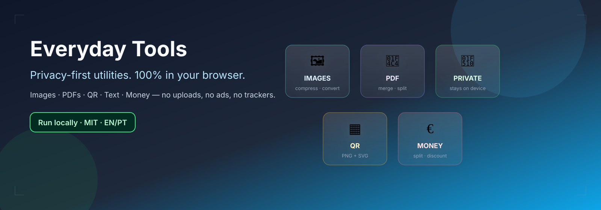
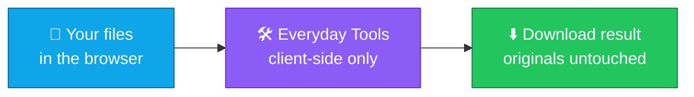

<p align="center">
  
</p>

<h1 align="center">everyday-tools</h1>

<p align="center">
  <strong>EN</strong> Free, privacy-first browser utilities — images, PDFs, QR, text &amp; money<br/>
  <strong>PT</strong> Utilitários gratuitos no browser, com foco em privacidade — imagens, PDFs, QR, texto e dinheiro
</p>

<p align="center">
  <a href="https://github.com/manansbdb/everyday-tools/blob/main/LICENSE"></a>
  
  
  
  
</p>

<p align="center">
  <a href="./README.pt.md">Português (README.pt.md)</a>
</p>

<p align="center">
  <strong>Live demo (free GitHub Pages):</strong> <a href="https://manansbdb.github.io/everyday-tools/">https://manansbdb.github.io/everyday-tools/</a><br/>
  <strong>Demo ao vivo:</strong> <a href="https://manansbdb.github.io/everyday-tools/">https://manansbdb.github.io/everyday-tools/</a>
</p>

---

## What it does / Para que serve

| English | Português |
|---------|-----------|
| **All processing happens on your device** — no uploads, no ads, no trackers, no signup. | **Todo o processamento ocorre no teu dispositivo** — sem uploads, anúncios, rastreadores ou cadastro. |
| Compress/convert images, merge/split PDFs, QR codes, text cleanup, money calculators. | Comprimir/converter imagens, mesclar/dividir PDFs, QR, limpeza de texto e calculadoras de dinheiro. |



---

## Tools / Ferramentas

| # | EN | PT |
|---|----|----|
| 1 | **Compress & resize images** — quality/size comparison; downloads new files (never overwrites originals) | **Comprimir e redimensionar imagens** — comparação tamanho/qualidade; baixa ficheiros novos |
| 2 | **Convert images** — PNG / JPEG / WebP with clear errors and size limits | **Converter imagens** — PNG / JPEG / WebP com erros claros e limites |
| 3 | **PDF merge, split, reorder** — client-side via [pdf-lib](https://pdf-lib.js.org/) | **PDF mesclar, dividir, reordenar** — no cliente com pdf-lib |
| 4 | **QR codes** — download PNG and SVG | **Códigos QR** — baixar PNG e SVG |
| 5 | **Text tools** — clean whitespace, remove duplicate lines, word count | **Texto** — limpar espaços, remover linhas duplicadas, contar palavras |
| 6 | **Money calculators** — discounts, unit price, bill split with tip | **Dinheiro** — descontos, preço unitário, divisão de conta com gorjeta |

---

## Privacy / Privacidade

- Files and text never leave your browser / Ficheiros e texto não saem do browser
- No analytics, ads, or accounts / Sem analytics, anúncios ou contas
- Optional Support/Donate UI is **disabled by default** (`src/config/support.ts`) / Secção Apoie **desativada por omissão**

---

## Install / Instalação

### Requirements / Requisitos

- Node.js **20+** (recommended)
- `npm` (or compatible)

### 1) Clone

```bash
git clone https://github.com/manansbdb/everyday-tools.git
cd everyday-tools
```

### 2) Install & run / Instala e corre

```bash
npm install
npm run dev
```

### 3) Tests & production build / Testes e build

```bash
npm test
npm run build
npm run preview
```

---

## Deploy (free) / Publicar (gratuito)

Static app — host the `dist/` folder anywhere.

**Demo is live / Demo ao vivo:** https://manansbdb.github.io/everyday-tools/

Served from the `gh-pages` branch (standard free public Pages). No paid plan required.

To redeploy after changes / Para republicar:

```bash
npm run build
# publish contents of dist/ to the gh-pages branch
```

Vite `base` is already `'./'` for relative assets.

---

## Size limits / Limites (soft)

| Type | Limit |
|------|-------|
| Images | 25 MB each, up to 20 files |
| PDFs | 50 MB each, up to 30 files |

Very large files may fail depending on device memory.

---

## Credits / Créditos

| Library | License | Use |
|---------|---------|-----|
| [React](https://react.dev/) | MIT | UI |
| [Vite](https://vitejs.dev/) | MIT | Build |
| [pdf-lib](https://github.com/Hopding/pdf-lib) | MIT | PDF merge/split/reorder |
| [browser-image-compression](https://github.com/Donaldcwl/browser-image-compression) | MIT | Image compress/resize |
| [qrcode](https://github.com/soldair/node-qrcode) | MIT | QR PNG/SVG |

---

## Limitations / Limitações

- Image conversion uses Canvas — animated GIFs typically become a single frame
- Encrypted/password-protected PDFs may fail (`ignoreEncryption`)
- Compression ratio depends on content; PNG often shrinks less than JPEG/WebP
- No server-side batch processing (by design)

---

## Contributing / Contribuir

See [CONTRIBUTING.md](./CONTRIBUTING.md). Keep EN + PT strings in sync.

---

## Support / Apoio

In-app Support/Donate UI is **disabled by default** (`src/config/support.ts` → `enabled: false`, empty wallet).

A UI de Apoio/Doações na app está **desativada por omissão** (`enabled: false`, sem wallet).

Do not invent wallet addresses. Enable only with a real address you control — see [CONTRIBUTING.md](./CONTRIBUTING.md).

Não inventes endereços de wallet. Ativa só com um endereço real que controlas.

---

## License / Licença

[MIT](./LICENSE) © 2026 manansbdb
